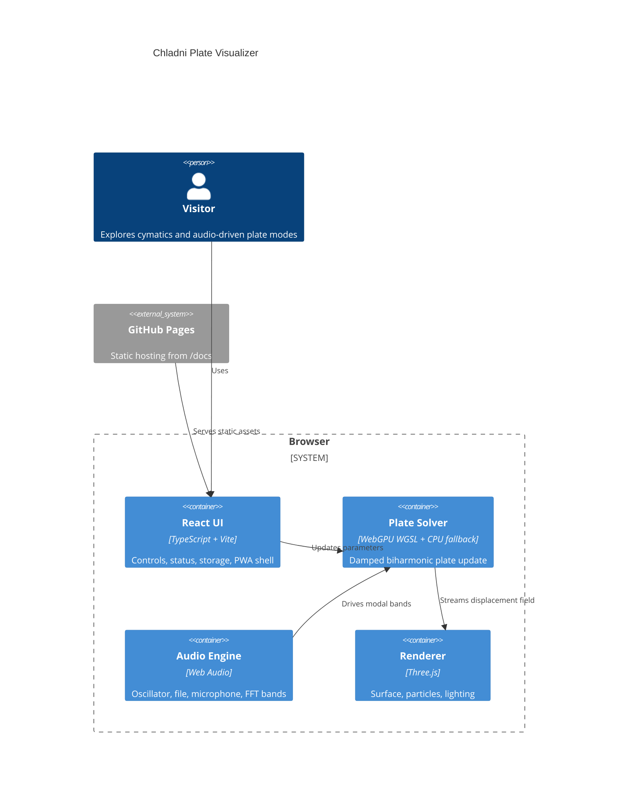

# Chladni Plate Visualizer

Live site: https://baditaflorin.github.io/chladni-plate-visualizer/

Repository: https://github.com/baditaflorin/chladni-plate-visualizer

Support: https://www.paypal.com/paypalme/florinbadita

An interactive WebGPU cymatics lab for vibrating plates, resonant sand patterns, and audio-driven spatial modes.

## Quickstart

```sh
npm install
make dev
make test
make build
make smoke
```

## What It Does

Chladni Plate Visualizer runs a damped plate PDE in the browser, renders the vibrating surface with Three.js, and lets sand-like particles settle into nodal curves. It can run from a frequency sweep, oscillator, uploaded audio, or microphone input through the Web Audio API.

The public app is fully static and published from `main` branch `/docs` on GitHub Pages.

## Architecture



## Project Docs

- Architecture: docs/architecture.md
- Deployment: docs/deploy.md
- ADRs: docs/adr/
- Privacy: docs/privacy.md
- Postmortem: docs/postmortem.md

## Local Hooks

```sh
make install-hooks
```

Hooks live in `.githooks/` and run local checks. No GitHub Actions are used.
