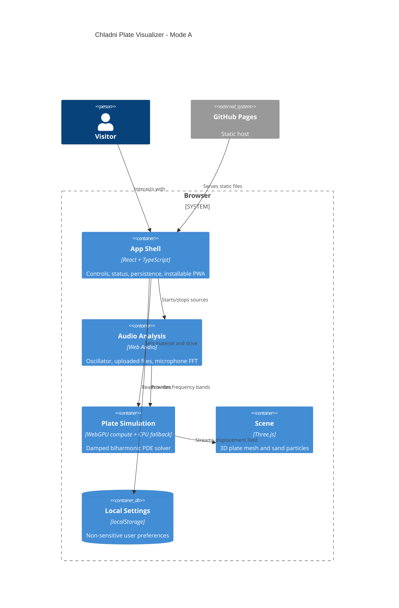

# Architecture

## Module Boundaries

- `src/features/plate/audio/`: browser audio input and FFT bands.
- `src/features/plate/simulation/`: PDE solvers and shared simulation contracts.
- `src/features/plate/visualizer/`: Three.js scene and sand particle update.
- `src/features/plate/math/`: deterministic functions covered by unit tests.
- `src/lib/`: app-wide storage, build metadata, and small utilities.
